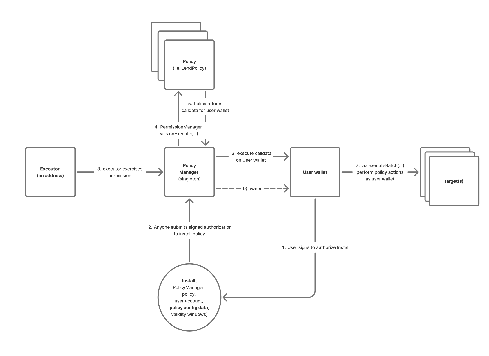

# Account Policies

Account Policies are a wallet-agnostic onchain mechanism for installing **constrained capability modules** (“policies”) on an account and executing policy-prepared actions via the account.

The protocol is intentionally split into:

* **`PolicyManager`**: a minimal orchestrator that tracks policy instances, verifies policy installation authorization, tracks lifecycle transitions and enforces invariants, and mediates policy execution on user accounts.
    - The `PolicyManager` must be an execution-enabled owner on the user smart contract wallet.
    - This is the core trust anchor: the account delegates execution capability to the manager, and the manager delegates *policy-specific* authorization to policies.
* **`Policy`**: a minimal hook interface that policy contracts implement to define authorization semantics and build a calldata payload that will serve as the wallet's call plan. 
    - Policies are modular and extensible, and are wallet-interface-aware (because they emit wallet call plans). The `PolicyManager` has no prior or fixed knowledge of specific policies.

The core idea is to keep the manager stable and generic, while letting policies express the application-specific logic: what’s allowed, under what conditions, and how to execute it safely.



## What this enables

Policies let an account pre-authorize *specific kinds of future actions* (often executed by a relayer/executor) without giving blanket control.

Possible patterns include:

* automation (recurring constrained actions)  
* delegated execution (third-party calls authorized by signatures/roles)  
* conditional actions (e.g., only when health factor is low)  
* budgeted actions (recurring limits)


## Core concepts

### Policy instance and `policyId`

A **policy instance** is a specific authorization of a specific policy contract for a specific account, under a specific binding. Each instance is identified by a deterministic `policyId`, derived from a signed binding:

```
PolicyBinding {
  account,
  policy,
  policyConfig,
  validAfter,
  validUntil,
  salt
}
```

`policyId = hash(binding)`.

**`policyId` names the authorization instance**, not “the policy in general.” Change any binding field (including `salt`) and you get a new instance ID.

### Config and execution payloads

* **`policyConfig`**: opaque config bytes embedded directly in the binding, decoded in the context of a specific policy. The EIP-712 encoding hashes this field (`keccak256(policyConfig)`) per the standard rules for dynamic `bytes` types.  
* **`executionData`**: opaque per-execution payload bytes. Policies interpret and authenticate these.
* **`uninstallData`**: optional opaque bytes passed to policy uninstall hooks for policy-defined authorization (e.g., executor signatures). This can be empty when not needed.

The manager does not impose a schema on either as this is left up to the interpreting policy.

### Validity windows

Bindings include `validAfter` / `validUntil`. The manager enforces these windows at install time and execution time.

A policy can treat these fields as pure protocol gating, or incorporate them into higher-level semantics (e.g. budgets bound to the install window).


## Lifecycle and ergonomics

### Install

A policy instance can be installed either:

* by a direct call from the account, or  
* via an account signature (ERC-6492-compatible, side effects allowed).

**Idempotent installs:** installing an already-installed `(policy, policyId)` is a no-op. The manager does not emit additional lifecycle transitions or re-run hooks.

Why:

* avoids brittle “first installer wins” races  
* prevents replayed signatures from retriggering policy-side effects  
* ensures policy hooks run exactly once per lifecycle transition

### Execute

To execute an action under an installed policy instance, callers invoke:

`PolicyManager.execute(policy, policyId, policyConfig, executionData)`

The execution flow is:

manager → policy → manager → account → manager → policy → manager

A policy authorizes the execution and returns:

* calldata to call on the account (the “actions”)  
* optional opaque bytes forwarded to the policy’s `onPostExecute` hook after the account call (post-call verification/steps)

If the policy returns empty calldata for both, the manager treats it as a no-op: no account call, no `onPostExecute`, and no `PolicyExecuted` event. This is how policies signal “nothing to execute” when called with empty `executionData` during `installWithSignature` or `replaceWithSignature`.

This pattern enables strong postconditions (balance deltas, state checks, approval resets) without requiring the manager to understand policy-specific semantics.
For example: a swap policy can snapshot balances before the wallet call, then verify `tokenOutDelta >= minOut` in `onPostExecute`.

### Uninstall

Uninstall revokes a policy instance and permanently disables that `policyId`.

`UninstallPayload` supports two addressing modes:

- **policyId-mode**: addresses the instance by `(policy, policyId)` where `policyId = hash(binding)`. This is the typical mode for installed instances — it does not require the full binding fields, which may not be available to relayers/indexers after installation.
- **binding-mode**: addresses the instance by the full `PolicyBinding` (which carries `policyConfig`). This mode supports both installed-instance uninstallation and pre-install permanent disabling.

The manager provides one global guarantee: **The account can always uninstall its own installed policy instances.**

If a policy’s uninstall hook reverts, the manager only allows that revert to block uninstallation for non-account callers. This prevents policies from trapping the account.
In other words: policies can set the terms of third-party uninstalls, but they can never make uninstall impossible for the user account.

### Pre-install uninstallation

Uninstallation can also be used to revoke (permanently disable) an installation intent **before** the policy is installed. This uses binding-mode, where the manager:

* computes `policyId = hash(binding)`  
* calls `policy.onUninstall(...)` for policy-defined authorization  
* permanently disables the `policyId` and emits the uninstall event

### Replace

Replacement atomically uninstalls an installed policy instance and installs a new one.

It is available both as:
- `replace(...)`: direct call by the account
- `replaceWithSignature(payload, userSig, deadline, executionData)`: account signature authorization (for relayers), optionally followed by execution

Replacement exists as a standardized atomic migration mechanism so integrators do not need to reinvent their own batching/migration flows, and so policies can rely on consistent lifecycle invariants during transitions.

### Install + optional execute convenience

The protocol includes an install+optional-execute convenience via `installWithSignature(..., executionData)`.

This **does not bind** the installation signature to the `executionData` (i.e., it is not an atomic intent-binding
signature). Policies MUST enforce their own execution authorization semantics.

---

## Trust and responsibility boundaries

A core goal of the protocol is to make the trust boundary explicit.

### What `PolicyManager` is responsible for

The manager is the generic, minimal enforcement layer:

* computes deterministic `policyId` from the binding  
* validates account signatures (or calls) for installs/replacements (ERC-6492 capable)  
* passes `policyConfig` from the binding to the policy on install (policies are responsible for authenticating config on execution)  
* enforces `validAfter` / `validUntil` at install and execute  
* maintains policy instance liveness state (installed / uninstalled)  
* enforces sticky disables (uninstallation permanently kills a `policyId`)  
* requires the ERC-6492 validator to be a deployed contract (checked at construction)  
* mediates all policy hooks and provides a consistent execution environment  
* guarantees “account can always uninstall installed instances”

### What policies are responsible for

Policies define all policy-specific semantics:

* execution authorization (who can execute and under what conditions)  
* decoding and validating `policyConfig` and `executionData`  
* replay protection and nonce discipline for executions  
* policy-specific limits and invariants (budgets, pinning, slippage bounds, thresholds, etc.)  
* any policy-specific state (stored config fields, budgets, uniqueness constraints, nonces)  
* optional third-party uninstallation rules (using `uninstallData`)  
* optional post-call validation/cleanup via the “policy → account → policy” sandwich

### Config handling strategy is explicitly policy-defined

The protocol supports both:

* **Calldata-heavy** policies: require callers to provide the config preimage on each execution, and verify it matches what was installed (cheap install; repeated calldata costs).  
* **Storage-heavy** policies: store needed config-derived data at install, and allow empty config on execute (more upfront state; cheaper repeated execution).

There is no universal best choice; it depends on config size, expected number of executions per install, and chain fee dynamics.

The manager stays neutral; policies decide.

### Uninstall is intentionally permissionless at the manager level

`PolicyManager.uninstall()` can be called by anyone. The manager does **not** gate uninstall to the account — it delegates uninstall authorization entirely to the policy's `onUninstall` hook. Policies define who (beyond the account) may trigger uninstall and under what conditions (e.g., executor signatures in AOA policies).

The manager's one guarantee is that **the account can always uninstall**, even if the policy hook reverts. Non-account callers are blocked when the hook reverts; this is the escape hatch.

Policy implementors must be aware: if `onUninstall` does not validate the `effectiveCaller` and does not revert for unauthorized callers, anyone will be able to uninstall that policy instance.

### Execute is intentionally permissionless at the manager level

`PolicyManager.execute()` can be called by anyone. Execution authorization is fully delegated to the policy's `onExecute` hook. Policies MUST enforce their own execution authorization (e.g., executor signature validation in AOA policies). A policy that does not validate the caller in `onExecute` would allow anyone to trigger execution.

---

## Security considerations for policy contracts

### Policy contracts MUST NOT be upgradeable

During execution, the `PolicyManager` calls the policy's `onExecute` hook and forwards the returned calldata to the account wallet. The PolicyManager is an execution-enabled owner of the wallet, so whatever calldata the policy returns will be executed with full account authority.

If a policy contract is deployed behind an upgradeable proxy, the proxy admin could change the policy's logic after users have installed it, causing it to return arbitrary calldata — potentially removing wallet owners, adding new owners, upgrading the wallet, or transferring funds.

**Policy contracts must be non-upgradeable.** Account holders should verify that any policy they install is not deployed behind a proxy before authorizing installation.

### Escape-hatch uninstall bypasses policy cleanup hooks

When the account force-uninstalls a policy via the escape hatch (i.e., the policy's `onUninstall` hook reverts but `effectiveCaller == account`), the manager marks the policyId as uninstalled but the policy's internal cleanup code does not run. Any per-policy state that would normally be cleared during uninstall (e.g., uniqueness constraints, market linkage maps) remains stale.

For the current AOA policy implementations, this is not a practical concern — the account-path fast path in `AOAPolicy._onUninstall` directly calls the cleanup logic (`_onAOAUninstall`) with only simple storage operations that cannot revert.

However, future policy authors should keep this in mind:

* **Policy uninstall hooks (especially the account path) should be kept simple and revert-free.** If the hook can revert, the escape hatch will bypass it, and any per-policy state won't be cleaned up.
* **Stale per-policy state can block re-installation.** For example, if a policy enforces a uniqueness constraint (e.g., one active policy per market), stale state from a bypassed uninstall could prevent installing a new policy for the same scope.
* **The manager's idempotency guard prevents re-running hooks.** Once a policyId is marked uninstalled, calling `uninstall` again is a no-op — the hook will not be retried.

### Install signatures do not bind to execution data

The `installWithSignature` convenience allows a relayer to atomically install a policy and trigger an execution. However, the account's install signature authorizes only the binding, not the execution data. The same install signature can be re-submitted with different execution data to trigger additional executions after the install becomes a no-op.

This is safe only if the policy independently authorizes each execution (as AOA policies do via executor signatures with per-execution nonces). Policy implementors must not rely on the install signature as proof of execution authorization.

---

## Notes on policy implementation

Policies implement the `Policy` hooks:

* `onInstall`: validate installation and optionally initialize policy state  
* `onUninstall`: authorize uninstall (including pre-install permanent disable) and optionally clean up policy state  
* `onExecute`: authorize execution and return a call plan (called on every execution path, including `installWithSignature` and `replaceWithSignature` — policies MUST handle empty `executionData` gracefully)  
* `onPostExecute`: optional post-execution hook called after the account call completes (e.g., for postcondition checks or cleanup)  
* `onReplace`: handle atomic replacement transitions (called with a role indicating whether this policy is the old or new side of the replacement)

Policies are only callable by the manager, which keeps the trust boundary clean and prevents integrators from bypassing lifecycle logic.

---

## Setup

This repo uses git submodules for dependencies (in `lib/`).

Clone with submodules:

```shell
git clone --recurse-submodules <repo>
```

If you already cloned without submodules:

```shell
git submodule update --init --recursive
```

### Build

```shell
forge build
```

### Test

```shell
forge test --offline
```

### Format

```shell
forge fmt
```